 

  

---

## 🧑‍💻 About me

- 🛒 Building **[PelleMarket](https://pellemarket.com)**, a local marketplace platform
- 🌐 Check out my work at **[matiasgs.com](https://matiasgs.com)**
- 💬 Let's connect on Discord or X

---

## 🛠️ Tech Stack

### Languages

### Frameworks & Libraries

### Tools & Hosting

 

---

## 📦 Project Stacks

A closer look at what each project actually runs on — some of this I know well, some I'm still learning.

<b>🛒 PelleMarket — local marketplace platform</b>

 

### Frontend

- Next.js 16 · React 19 · TypeScript
- Tailwind CSS 4
- PostCSS · tw-animate-css · tailwind-merge · clsx · class-variance-authority
- shadcn/ui · Base UI · Lucide · React Icons · Sonner
- SWR
- React Hook Form + Zod
- Recharts
- dnd-kit
- react-easy-crop
- qrcode
- next-pwa
- Capacitor 8
- Appwrite SDK
- Sentry
- Mixpanel
- Vercel Analytics + Speed Insights

### Backend

- Node.js · Express · TypeScript
- tsx
- node-appwrite
- JWT / jsonwebtoken
- bcrypt
- CORS · dotenv
- Multer
- Nodemailer
- web-push
- firebase-admin
- Sentry

### Services / Infrastructure

- Appwrite Cloud
- Appwrite isolated DEV project
- Mercado Pago
- Coolify
- Custom in-memory rate limiting

### QA

- Playwright + TypeScript

<b>👻 Phantom — POS system</b>

 

### Backend

- Python 3.13
- FastAPI · Uvicorn
- SQLAlchemy 2.0
- SQLite
- Alembic
- Pydantic v2
- pydantic-settings
- PyJWT
- bcrypt
- OAuth2PasswordBearer
- API Key authentication
- pytest
- Starlette / httpx TestClient

### Frontend

- Vite 8
- React 19
- TypeScript 6
- Tailwind CSS v4
- `@tailwindcss/vite`
- lucide-react
- Recharts
- Motion
- @formkit/auto-animate
- Sonner
- canvas-confetti
- oxlint
- Custom UTF-8 BOM CSV export
- `@media print` receipts

<b>🌐 Portfolio — matiasgs.com</b>

 

### Core

- Next.js 16
- App Router
- Turbopack
- React 19
- TypeScript 5
- Strict mode
- Tailwind CSS 4

### Interface & Motion

- Motion 13
- Lucide
- React Bits
- Custom Canvas 2D
- Inter Tight
- Instrument Serif
- JetBrains Mono

### Visual Effects

- Dot Field
- Shape Grid
- Particles
- Threads
- LightRays
- Squares
- DotField
- ClickSpark
- Scroll parallax
- Magnetic cursor
- Spotlight effects

### Framework Features

- `next/image`
- `next/og`
- Metadata API
- `sitemap.ts`
- `robots.ts`
- JSON-LD

### Tooling

- ESLint 9
- `eslint-config-next`
- PostCSS

---

## 📊 GitHub Stats

  

---

## 📈 Activity

---

## 🚀 Featured Project

  

Live local e-commerce platform, presented to the Pellegrini Chamber of Commerce.

---

## 📫 Contact

 

